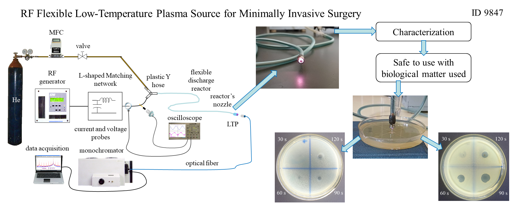

# Flexible Low-Temperature RF Plasma Source for Biomedical Applications

**Manuscript ID:** IEEE LATAM Submission ID: 9847 
**Authors:**  
- Rosendo Peña-Eguiluz 
- Antonio Mercado-Cabrera  
- Alma N. Hernández-Arias
- Benjamín G. Rodríguez-Méndez
- Régulo López-Callejas
- Raúl Valencia-Alvarado
- Bethsabet Jaramillo-Sierra

Affiliations: \
1 Plasma Physics Laboratory,   Instituto Nacional de Investigaciones Nucleares\
2 Universidad Tecnológica del Valle de Toluca\
3 Instituto Tecnológico Nacional,   Tecnológico de Estudios Superiores de Tianguistenco\
Mexico

---
Flexible Low-Temperature RF Plasma Source for Biomedical Applications

  

---

## 📂 Required Files

- `voltage current 12W.opj` : data corresponding to voltage and current characteristics shown in Fig. 3.
- `OE spectrum flexible LTP.opj` : data obtained from the monochromator-data acquisition system of the optical emission sprectrum depicted in Fig. 5.
- `UVx characterization flexible LTP.xlsx` : data corresponding to UVB and UVC emissions represented in Figs. 6 and 7.
- `Temp characterization flexible LTP.xlsx` data corresponding to the averaged values of temperature generated by the plasma of Fig. 8.
- `E coli inacivation.opj` data of the result for the deactivation of E coli that are shown in Figs. 12 and 13.

---

## 💻 Requirements

- OriginPro 8.5 or later.

---

## ✉️ Contact

For questions or replication of results:  
rosendo.eguiluz@inin.gob.mx
